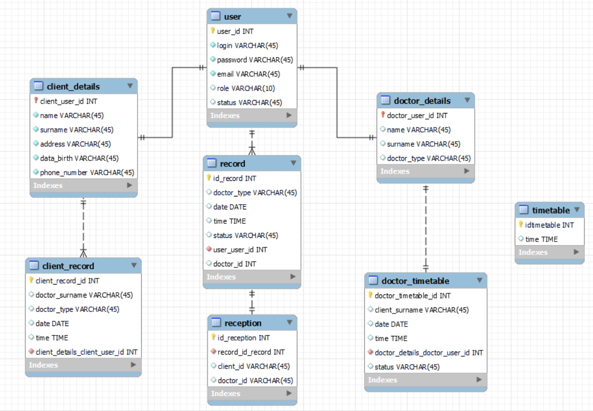
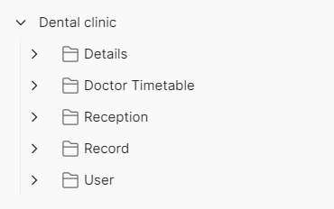

# Dental clinic

### RESTful Web-application  is written using the following technologies:
  - Gradle
  - JDBC
  - MySQL DB
  - Spring Framework

### Short description of the project:

The application allows users to register, perform various actions on their data (adding, changing, deleting), search for different parameters, as well as make an appointment with one of our doctors, who, in turn, is added by the administrator, and just like the client can perform various actions with their data.
# Data model

## ER diagram for the data model

## Tables

 - User: Contains the information about all the users
   - User id
   - Login
   - Password
   - Email
   - Role
   - Status
 - Client details: Contains the  client's personal information
   - Client id
   - Name
   - Surname
   - Address
   - Data birthday
   - Phone number
 - Doctor details: Contains the  doctor's information
   - Doctor id
   - Name
   - Surname
   - Doctor type
 - Record: Contains records which are made by clients
   - Record id
   - Doctor type
   - Date
   - Time
   - Status
   - User id (Client id)
   - Doctor id
 - Reception: Contains the necessary IDs to confirm the record
   - Reception id
   - Record if
   - Client id
   - Doctor id
 - Doctor timetable: Contains records confirmed by reception  and available for viewing for doctors
   - Doctor timetable id
   - Client surname
   - Date
   - Time
   - Doctor id
   - Status
 - Client record: Contains records confirmed by reception  and available for viewing for clients
   - Client record id
   - Doctor surname
   - Doctor type
   - Date
   - Time
   - Client id
 - Timetable: Contains clinic's work hours
   - Timetable id
   - Time

## RESTful API

**1. API Description for User**

METHOD | PATH | DESCRIPTION
------------|-----|------------
POST | /api/users/ | add new user
DELETE | /api/users/{id} | delete user by id
PATCH | /api/users/{id} | update user by id
GET | /api/users/{id} | get user by id
GET | /api/users/params | get user by params(status, role, surname), if query without params - get all users

**2. API Description for Details**

METHOD | PATH | DESCRIPTION
------------|-----|------------
POST | /api/details/{id} | add client details
PATCH | /api/details/{id} | update client details by id
GET | /api/details/{id} | get client details by id
GET | /api/details/{id}/info | get all client details by id
GET | /api/details/{id}/records | get client records by id
POST | /api/details/admin/{id} | add doctor details
PATCH | /api/details/admin/{id} | update doctor details by id
GET | /api/details/doc/{id} | get doctor details by id
GET | /api/details/doc/{id}/info | get all doctor details by id
GET | /api/details/doc/?type= | get doctor details by doctor type

**3. API Description for Record**

METHOD | PATH | DESCRIPTION
------------|-----|------------
POST | /api/records/{id} | add record by client id
DELETE | /api/records/{id} | delete record by id
PATCH | /api/records/{id} | update record by id
GET | /api/records/?status= | get user by status, if status not transferred - get all records
GET | /api/records/{id} | get record by id and param(client/doctor)

**4. API Description for Reception**

METHOD | PATH | DESCRIPTION
------------|-----|------------
POST | /api/reception/{id} | confirm record by id
GET | /api/records/ | get doctor's free time specifying date and doctor type in request body

**5. API Description for Doctor timetable**

METHOD | PATH | DESCRIPTION
------------|-----|------------
GET | /api/doctor/timetable/{id} | get record by id
GET | /api/doctor/timetable/{id}/all | get all records by doctor id
GET | /api/doctor/timetable/date | get record by date in params

### Prerequisites:

- Tomcat
- Java 11
- MySQl

### Project requests are grouped as follows in Postman:

### Click button to try

